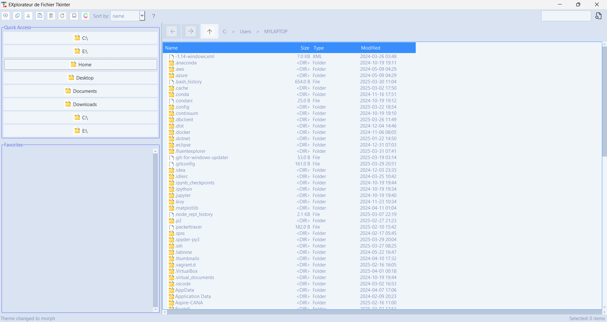

# File Explorer with Tkinter

A simple file explorer built using Tkinter with enhanced functionalities and cross-platform compatibility.

## Features

| Core Functionalities         | Bonus Functionalities |
|------------------------------|-----------------------|
| Directory navigation          | Grid/List view toggle |
| Context menu (Open/Delete/Rename) | Theme switching (Light/Dark) |
| Favorites management          |                       |
| File search                   |                       |
| File info display (size, date)|                       |
| Error handling                |                       |
| File type filtering           |                       |

## Demo Videos
- [Basic Navigation](https://sos092005.github.io/videos/v1.mp4)
- [Context Menu & Favorites](https://sos092005.github.io/videos/v2.mp4)
- [Theme Switching](https://sos092005.github.io/videos/v3.mp4)
- [Search Function](https://sos092005.github.io/videos/v4.mp4)
- [Error Handling](https://sos092005.github.io/videos/v5.mp4)

## Challenges & Solutions

| Problem                        | Solution Implemented          |
|--------------------------------|-------------------------------|
| Multi-file import complexity   | Consolidated into [single-file structure](https://github.com/Sos092005/Explorateur_de_fichier_Tkinter/blob/main/Version_finale/four.py) |
| Linux compatibility issues     | Used platform-agnostic libraries |
| Third-party installs (Pillow, ttkbootstrap) | Added detailed requirements.txt |
| Video presentation             | Hosted compressed videos on [GitHub Pages](https://sos092005.github.io) |
| Icon loading failures          | Implemented fallback paths    |

## Roadmap
- Improve search accuracy
- Optimize import structure
- Add file preview functionality

`📁 Repository Link:` [Explore Code](https://github.com/Sos092005/Explorateur_de_fichier_Tkinter)
